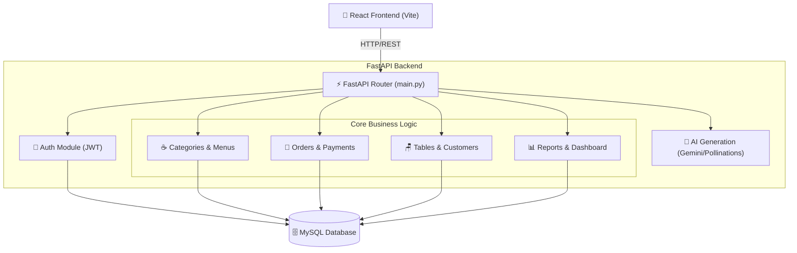
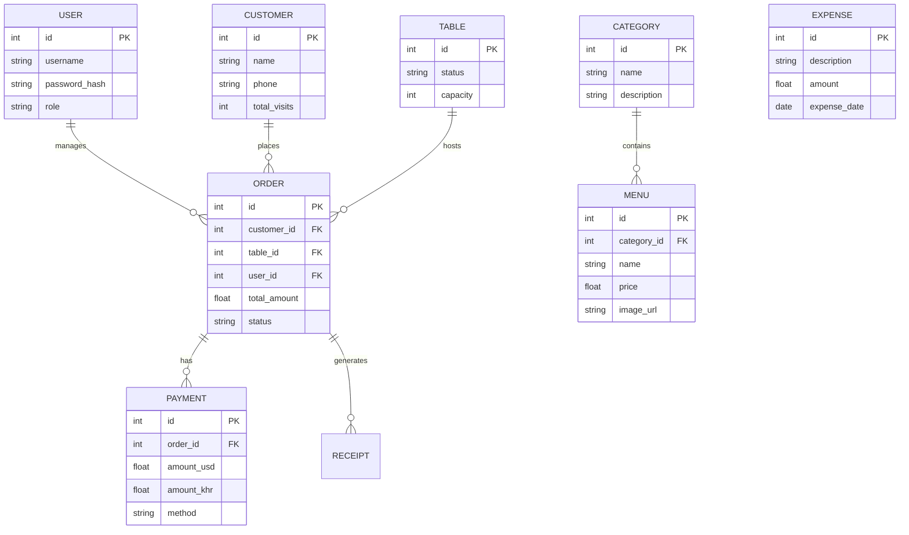

# Coffee Shop System Analysis Diagrams

Based on the structure of your backend (`main.py`), here are the analysis diagrams outlining the system's architecture, data models, and API routing.

## 1. High-Level Architecture Diagram
This diagram shows how the React Frontend communicates with the FastAPI Backend, which then routes requests to specific modules and interacts with the MySQL database.



---

## 2. Entity Relationship Diagram (ERD)
Based on the SQLAlchemy models imported in your `main.py`, here is the logical relationship between the core entities in the database.



---

## 3. API Routing Structure
Here is how the API endpoints are structured and organized via the APIRouter in `main.py`.

```mermaid
mindmap
  root((Coffee Shop API))
    Security
      (/auth) Login & Registration
    Inventory
      (/categories) Manage Categories
      (/menus) Manage Food & Drinks
    Operations
      (/tables) Table Status
      (/customers) Customer CRM
      (/orders) Order Processing
    Finance
      (/payments) Checkout & Currency
      (/expenses) Shop Expenditures
      (/receipts) PDF Generation
    Analytics
      (/dashboard) Daily Summary
      (/reports) Profit & Loss PDF/Excel
    AI Services
      (/ai) Menu & Image Generation
```

> [!TIP]
> You can include these diagrams in your main documentation or use them for team presentations. The diagrams are generated using Mermaid.js syntax, which is natively supported by GitHub Markdown!
